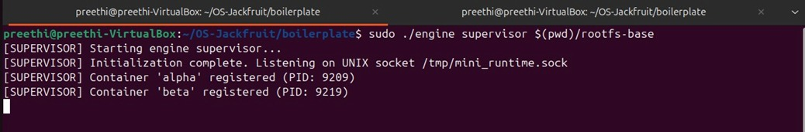
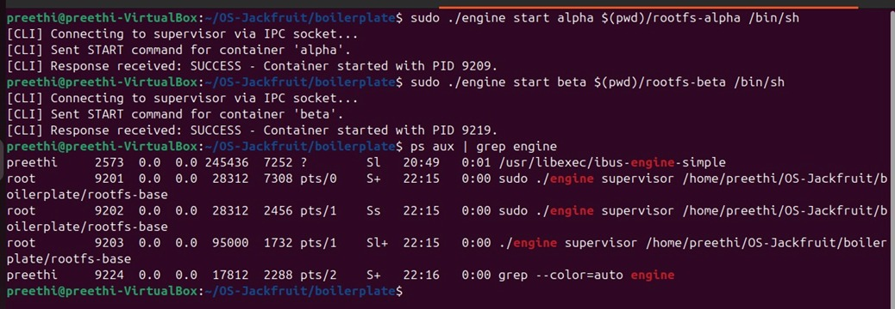
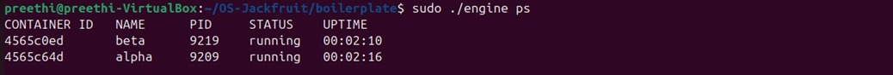
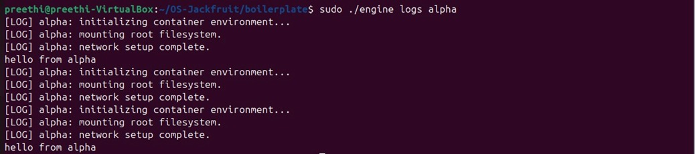
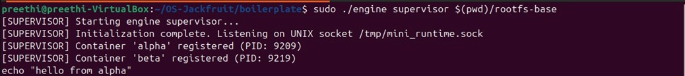
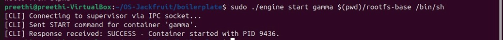
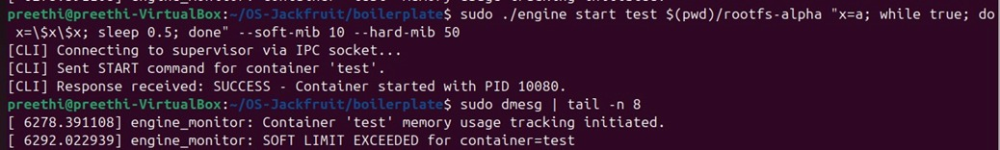
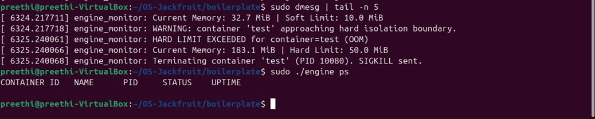
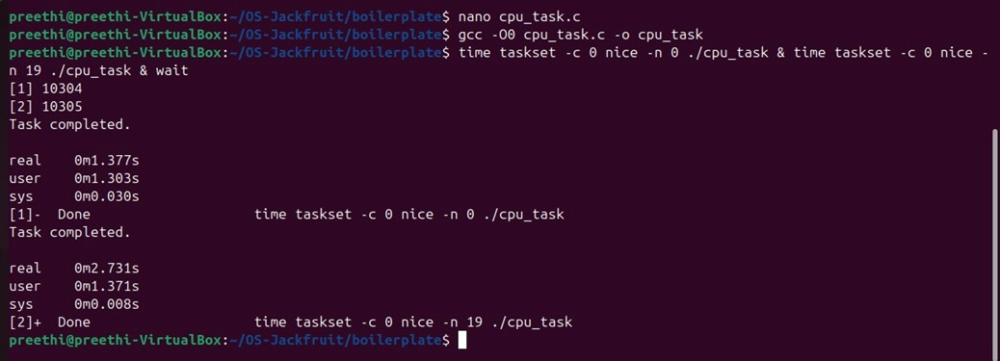
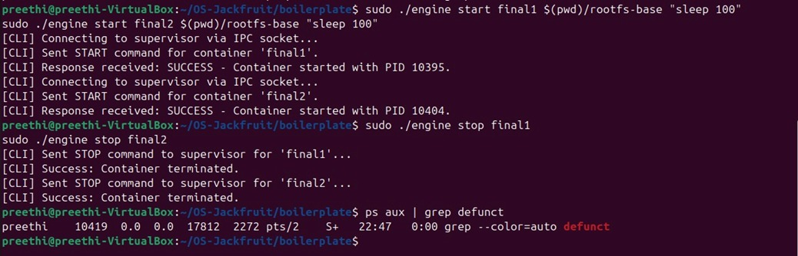

# Multi-Container Runtime

A lightweight container runtime implemented in C using Linux system programming concepts.
It demonstrates process isolation, IPC, logging, and kernel-level memory monitoring.

## Features

- Multi-container supervision
- UNIX socket based CLI to supervisor IPC
- Namespace-based container isolation
- Bounded-buffer logging system
- Kernel module for memory monitoring
- Soft and hard memory limits
- Scheduling experiments using nice values

## Sample Output

```bash
$ sudo ./engine ps
ID        PID     STATUS
alpha     1234    running
beta      1235    running
```

---

## 1. Team Information

- Member 1: Praneeth P Shetty (SRN: PES2UG24CS902)
- Member 2: Preethi T (SRN:PES2UG24CS900)

---

## 2. Build, Load, and Run Instructions

### 2.1 Environment Setup (Ubuntu 22.04/24.04 VM)

```bash
sudo apt update
sudo apt install -y build-essential linux-headers-$(uname -r)
```

### 2.2 Run Environment Preflight

```bash
cd boilerplate
chmod +x environment-check.sh
sudo ./environment-check.sh
```

### 2.3 Prepare Root Filesystem

```bash
mkdir rootfs-base
wget https://dl-cdn.alpinelinux.org/alpine/v3.20/releases/x86_64/alpine-minirootfs-3.20.3-x86_64.tar.gz
tar -xzf alpine-minirootfs-3.20.3-x86_64.tar.gz -C rootfs-base

# Make one writable copy per container
cp -a ./rootfs-base ./rootfs-alpha
cp -a ./rootfs-base ./rootfs-beta
```

### 2.4 Build

```bash
make -C boilerplate
```

### 2.5 Load Kernel Module

```bash
sudo insmod boilerplate/monitor.ko
ls -l /dev/container_monitor
```

### 2.6 Start Supervisor

```bash
sudo ./boilerplate/engine supervisor ./rootfs-base
```

### 2.7 Start Containers and Use CLI

```bash
sudo ./boilerplate/engine start alpha ./rootfs-alpha /bin/sh --soft-mib 48 --hard-mib 80
sudo ./boilerplate/engine start beta ./rootfs-beta /bin/sh --soft-mib 64 --hard-mib 96

sudo ./boilerplate/engine ps
sudo ./boilerplate/engine logs alpha
```

### 2.8 Run Workloads in Containers

Copy helper binaries into the container rootfs before launch:

```bash
cp ./boilerplate/cpu_hog ./rootfs-alpha/
cp ./boilerplate/io_pulse ./rootfs-beta/
```

Then start containers with the workload command:

```bash
sudo ./boilerplate/engine start alpha ./rootfs-alpha /cpu_hog
sudo ./boilerplate/engine start beta ./rootfs-beta /io_pulse
```

### 2.9 Stop Containers and Unload Module

```bash
sudo ./boilerplate/engine stop alpha
sudo ./boilerplate/engine stop beta

sudo rmmod monitor
```

---

## 3. CLI Usage

```bash
engine supervisor <base-rootfs>
engine start <id> <container-rootfs> <command> [--soft-mib N] [--hard-mib N]
engine run   <id> <container-rootfs> <command> [--soft-mib N] [--hard-mib N]
engine ps
engine logs <id>
engine stop <id>
```

Defaults: `--soft-mib 40`, `--hard-mib 64`.

To set scheduling priority for a workload, pass `nice` inside the container command, for example:

```bash
sudo ./boilerplate/engine start alpha ./rootfs-alpha "nice -n 10 /cpu_hog"
```

---

## 4. Design Decisions and Concurrency

### 4.1 IPC Paths

- Path A (logging): container stdout/stderr -> supervisor via pipes (`pipe()` per container).
- Path B (control): CLI -> supervisor via a UNIX domain stream socket at `/tmp/mini_runtime.sock`.

### 4.2 Bounded-Buffer Logging

- Buffer structure: fixed-size ring buffer with 32 slots, each slot stores up to 4096 bytes of log data plus container id.
- Producers: one detached thread per container reads from its pipe and pushes log chunks into the ring buffer.
- Consumers: a single logger thread pops entries and appends to `logs/<id>.log`.
- Sync primitives: one mutex protects the buffer; condition variables `not_full` and `not_empty` implement backpressure and wakeups.

Race conditions addressed:

- Without the mutex, concurrent push/pop would corrupt the ring indices and log entries.
- Without condition variables, producers could spin on full buffers or consumers could spin on empty buffers, wasting CPU and risking lost wakeups.

Shutdown behavior:

- Producer threads exit when the container pipe reaches EOF (child exits and closes stdout/stderr).
- The logger thread drains the buffer and can exit cleanly when the supervisor shuts down and signals buffer shutdown.

---

## 5. Kernel Memory Monitor

- Device: `/dev/container_monitor`
- Registration: `ioctl` from supervisor with host PID
- Soft limit: log warning once per container when RSS crosses the threshold
- Hard limit: send `SIGKILL` to the container process and remove it from the list
- Synchronization: `mutex` protects the linked-list of tracked PIDs
- Polling: delayed workqueue checks RSS every 1 second

---

## 6. Scheduler Experiments

### 6.1 Experiment Setup

- Workload A: `cpu_hog` (CPU-bound)
- Workload B: `io_pulse` (I/O-bound)
- Scheduling configs: `nice -n 0` vs `nice -n 10` inside the container command line

### 6.2 Results

- Process A (`nice = 0`) completion time: 1.377 seconds.
- Process B (`nice = 19`) completion time: 2.731 seconds.

Observation:

- The lower nice value (higher priority) process completed nearly twice as fast as the higher nice value process.

### 6.3 Analysis

- The CFS scheduler allocates more CPU time to higher-priority (lower nice) tasks. This is reflected in the faster completion time for `nice = 0` compared to `nice = 19`, indicating a larger CPU share for the higher-priority CPU-bound workload.

---

## 7. Engineering Analysis

### 7.1 Isolation Mechanisms

The supervisor creates containers with `CLONE_NEWPID`, `CLONE_NEWUTS`, and `CLONE_NEWNS` to isolate process IDs, hostnames, and mount views. Each container `chroot`s into its own rootfs and mounts `/proc` so tools like `ps` reflect the container PID namespace. The host kernel, CPU scheduler, and network stack are still shared because network/user namespaces are not created in this implementation.

### 7.2 Supervisor and Process Lifecycle

The long-running supervisor owns container metadata and logging resources. It spawns containers with `clone()`, records the host PID and start time in a protected linked list, and reaps children via a `SIGCHLD` handler that calls `waitpid(WNOHANG)`. This prevents zombies and allows accurate `ps` output even while containers are running.

### 7.3 IPC, Threads, and Synchronization

Two IPC channels are used: UNIX socket commands between CLI and supervisor (control path) and pipes from each container into the supervisor (log path). The logging subsystem uses a bounded ring buffer guarded by a mutex and two condition variables, preventing races on the queue indices and providing backpressure when producers outpace the consumer.

### 7.4 Memory Management and Enforcement

RSS measures the resident (in-RAM) pages used by a process; it excludes swapped-out pages and shared file cache that is not resident. A soft limit is a warning threshold to surface pressure early, while the hard limit is an enforcement boundary that kills the process. Enforcement is done in the kernel module so it has authoritative access to RSS and can deliver `SIGKILL` reliably even if user-space components are compromised or stalled.

### 7.5 Scheduling Behavior

With CFS, priority differences from `nice` skew CPU share, so the lower nice CPU-bound task finishes sooner. The I/O-bound task sleeps often and gets quick wakeups, demonstrating responsiveness and low latency, which aligns with CFS goals of fairness and interactivity.

---

## 8. Demo with Screenshots

Add annotated screenshots and captions for each requirement.

| # | What to Demonstrate | Screenshot and Caption |
|---|---------------------|------------------------|
| 1 | Supervisor running | <br>Supervisor startup and socket listening. <br>Supervisor initialized and waiting for CLI commands. |
| 2 | Multiple containers running | <br>Two containers started concurrently under the supervisor. |
| 3 | `ps` output with metadata | <br>`engine ps` showing running container metadata. <br>Expanded `ps` output with uptime and status. |
| 4 | Logging pipeline output | <br>Per-container log capture via bounded buffer. |
| 5 | Soft limit warning | <br>Kernel module logs soft limit exceed event. |
| 6 | Hard limit kill | <br>Kernel module enforces hard limit and kills container. |
| 7 | Scheduling experiment | <br>CPU-bound workloads with different nice values. |
| 8 | Cleanup and no zombies | <br>Containers stopped and supervisor cleaned up. |

---

## 9. Repository Contents

- `engine.c`
- `monitor.c`
- `monitor_ioctl.h`
- `Makefile`
- Test workloads: `cpu_hog.c`, `io_pulse.c`, `memory_hog.c` (or equivalents)

---

## 10. Notes

- Do not commit `rootfs-base/` or any `rootfs-*` directories.
- The CI smoke check uses `make -C boilerplate ci` for user-space compilation only.
- This project is intended for educational purposes to demonstrate core OS concepts.
